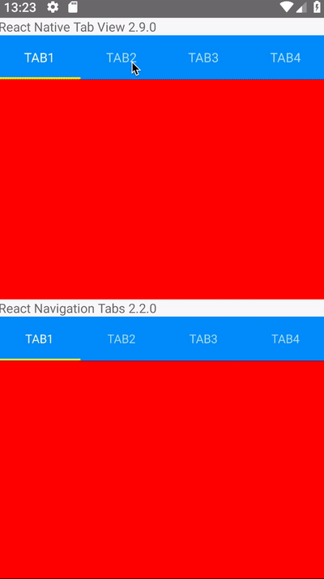

There were a lot of issues about a delay when pressing a tab in react-native-tab-view. But there may be a second problem, if you use it through react-navigation-tabs:

### Current behaviour

Delayed transition on tab press when importing createMaterialTopTabNavigator from react-navigation-tabs (latest 2.2.0)

**Touch -> Ripple -> Transition**

### Expected behaviour

Not delayed transition on importing createMaterialTopTabNavigator from react-navigation (latest 3.11.1) or pure react-native-tab-view (latest 2.9.0)

**Touch -> Transition -> Ripple**

### Code sample

git@github.com:Rebsos/react-navigation-tabs-delay-demo.git

### Screenshots (if applicable)

### What have you tried

Pure react-native-tab-view (latest) does not have this problem. Pure React-Navigation (without import createMaterialTopTabNavigator from react-navigation-tabs) does also not have this problem, it uses an older version of react-navigation-tabs. Occurs in release and dev mode.

### Your Environment

| software              | version
| --------------------- | -------
| ios or android        | android
| react-native          | 0.59.10
| react-navigation-tabs | 2.2.0
| node                  | 8.12.0
| npm or yarn           | yarn
